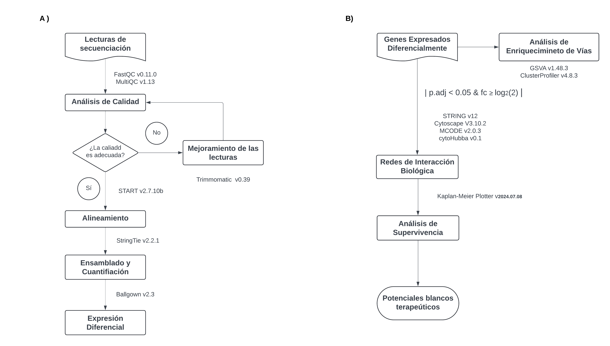
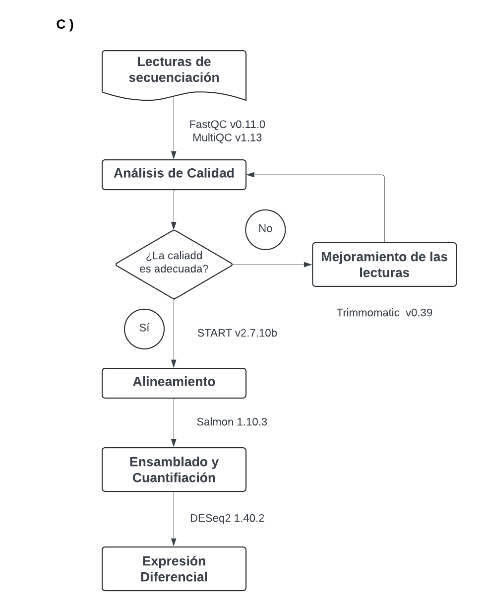
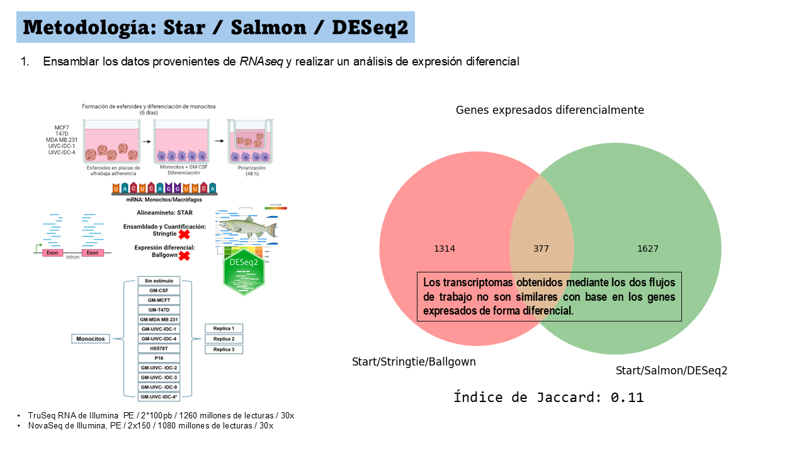
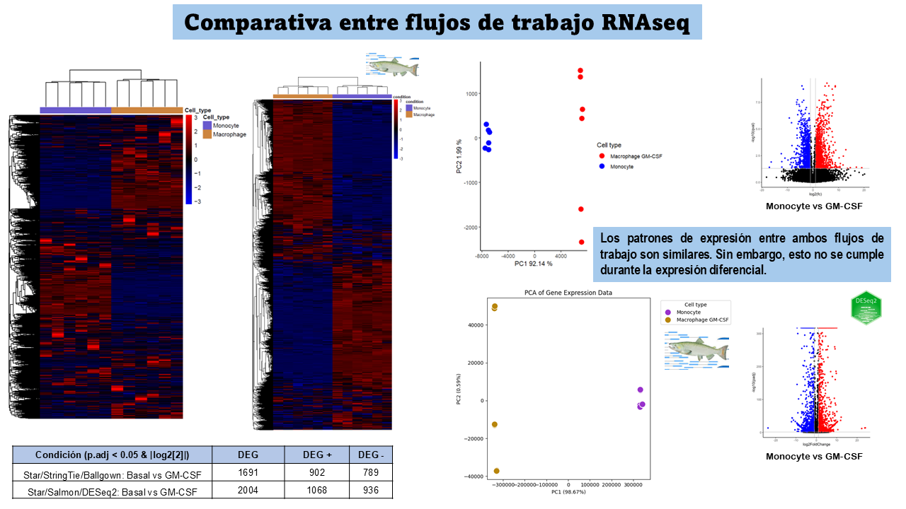

# **Transcriptoma UIVC**
### **Análisis de Macrófagos en el Microambiente Tumoral del Cáncer de Mama**

El ensamblaje del transcriptoma en un inicio se realizó utlizando [STAR](https://github.com/alexdobin/STAR?tab=readme-ov-file) como alineador, [StringTie](https://ccb.jhu.edu/software/stringtie/) como ensamblador y cuantificador de transcritos. La  expresión diferencial se realizó con [Ballgown](https://www.bioconductor.org/packages/devel/bioc/vignettes/ballgown/inst/doc/ballgown.html). 

La selección de estas herramientas para el ensamblaje del transcriptoma se basó en la sugerencia del Dr. Alfonso Méndez Tenorio del Instituto Politécnico Nacional (IPN). Las revisamos en la literatura y observamos que efectivamente son empleadas para el ensamblaje de transcriptomas y que gozaban de cierta popularidad y respaldo por parte de sus desarrolladores.

Durante los tutorales surgió la observación sobre la popularidad de estás herramientas, y con el paso del tiempo y experiencia en el área, notamos que en efecto no son las herramientas de consenso. Por ejemplo, [DESeq2](https://bioconductor.org/packages/release/bioc/html/DESeq2.html)  es más popular y empleada que [Ballgown]((https://www.bioconductor.org/packages/devel/bioc/vignettes/ballgown/inst/doc/ballgown.html)), de menos en nuestro campo de estudio.

Para resolver esta problemática, consulté cuáles herramientas podríamos emplear en lugar de [StringTie](https://ccb.jhu.edu/software/stringtie/) y [Ballgown](https://www.bioconductor.org/packages/devel/bioc/vignettes/ballgown/inst/doc/ballgown.html). Con base en los flujos de trabajo en [nf-core/rnaseq](https://nf-co.re/rnaseq/3.14.0/) y una revisión en la literatura, opté por trabajar con [Salmon](https://salmon.readthedocs.io/en/latest/) para el ensamblaje y  cuantificación de transcritos. Para el tema de la expresión diferencial he empleado [DESeq2](https://bioconductor.org/packages/release/bioc/html/DESeq2.html).

Para comparar los resultados entre ambos flujos de trabajo, ensamblé un par de muestras con ambos grupos de herrameintas y al final comparé la similitud entre los genes expresados de forma diferencial.

El resultado indica que ambos transcriptomas no son similares (Índice de Jackard de 0.11), de menos con los genes expresados diferencialmente. Sin embargo, los perfiles transcripcionales son similares y los procesos enriquecidos en ambos fluhos de trabajo son similares aunque no se definan con los exactamente con los mismos genes.

--- 

### **¡Ayuda!**
¿Qué flujo de trabajo me recomiendan utilziar?

**¡ Muchas gracias :) !**

